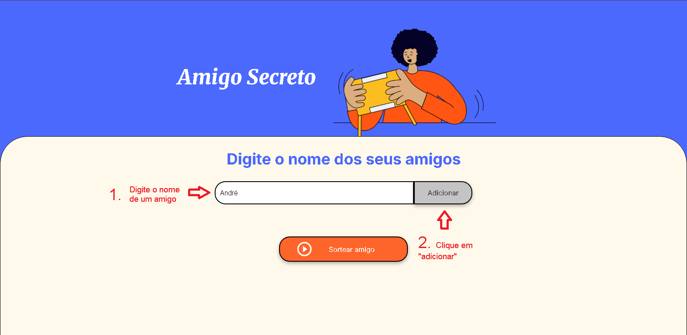
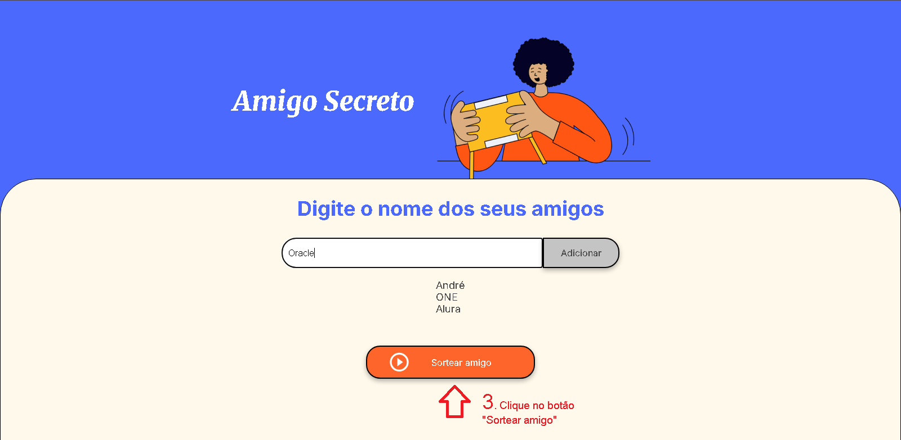

# Challenge Amigo Secreto

Site para adicionar amigos em uma lista e sortear o escolhido.

Projeto de desafio desenvolvido para **praticar JavaScript** durante meus estudos no programa **ONE (Oracle Next Education)**.


---

### 🚀 Tecnologias

- **HTML5**: Estrutura do site
- **CSS3**: Estilização e responsividade
- **JavaScript (ES6+)**: Lógica do sorteio

---

### 📚 Aprendizado com o Projeto

Durante o desenvolvimento, pratiquei e aprimorei conceitos como:

- 🖱 **Manipulação do DOM**: Alterando elementos HTML dinamicamente  
- ⚙ **Funções**: Organizando e reutilizando blocos de código  
- 📦 **Array**: Armazenando e manipulando dados de forma dinâmica com vetor  
- 🔁 **Laços de repetição**: Uso do **for** para iterações
- 📋 **Trello**: Desenvolvimento de acordo com backlog list no Trello

---

### ⭐ Funcionalidades

✅ Adicionar **nomes** de amigos  
✅ **Sortear** um amigo da lista   
✅ **Resultado** com o amigo secreto escolhido  

---

### 📦 Instalação

1. Clone o repositório
    ```bash
    git clone https://github.com/andremelchior/Amigo-Secreto.git
    ```

2. Acesse a pasta do projeto
    ```bash
    cd Amigo-Secreto
    ```

3. Abra no VSCode
    ```bash
    code .
    ```

### ▶️ Como executar

1. Abra a pasta do projeto
    ```bash
    Numero-Secreto/
    ```

2. Abra o arquivo **index.html** em seu navegador
    ```bash
    Numero-Secreto/
    ├── assets/          
    ├── LICENSE          
    ├── app.js          
    ├── index.html   <──     
    ├── style.css       
    └── README.md          
    ```
ou

👉 Clique [AQUI](https://andremelchior.github.io/Amigo-Secreto/) para acessar o site online

---

### 📖 Tutorial

1. Digite o nome de um amigo e o adicione



<br>

2. Adicione mais amigos e depois clique em "Sortear amigo"



<br>

3. Veja o resultado do sorteio :)


### 📝 Licença

Esse projeto está sob a [licença MIT](https://github.com/andremelchior/Amigo-Secreto?tab=MIT-1-ov-file#readme).

---
